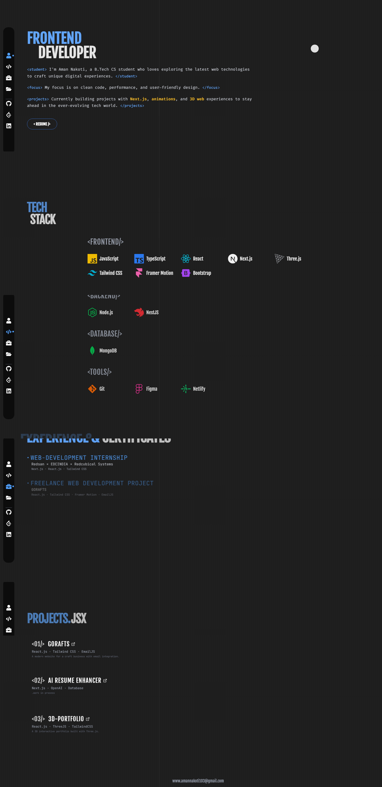

# 🌌 VSCode-Inspired Portfolio with Next.js & Framer Motion



Welcome to my **personal portfolio**, inspired by **VSCode** and infused with a subtle **Demon Slayer / dark anime vibe**. This project showcases my web development journey with modern tools, smooth animations, and interactive experiences.

---

## 🚀 Features

- **VSCode-inspired UI** – Clean, developer-friendly interface.  
- **Next.js** – Fast SSR and SSG for modern web apps.  
- **Framer Motion** – Smooth, responsive animations.  
- **Responsive Design** – Optimized for mobile, tablet, and desktop.  
- **Project Showcase** – Highlighting real-world projects with hover previews.  
- **Dark Anime Vibe** – Aesthetic inspired by dark anime and glowing neon colors.  

---

## 🛠️ Tech Stack

| Technology | Role |
|------------|------|
|  | Framework |
|  | UI Library |
|  | Styling |
|  | Animations |
|  | Deployment |

---

## 📂 Projects Showcase

- **GORAFTS** – Modern craft business website with email integration.  
- **AI Resume Enhancer** – Next.js + OpenAI powered resume builder.  
- **3D Portfolio** – Interactive 3D portfolio with Three.js.  
- **Amazon Clone** – Functional clone of Amazon using vanilla HTML/CSS/JS.  

Hover over each project in the portfolio to see an **animated preview** with a glowing effect.

---

## 🛠️ Getting Started

Clone the repository and run it locally:

```bash
# Clone the repository
git clone https://github.com/Aman17123/portfolio-nextjs.git

# Navigate to the project folder
cd portfolio-nextjs

# Install dependencies
npm install

# Start development server
npm run dev

# Build for production
npm run build
